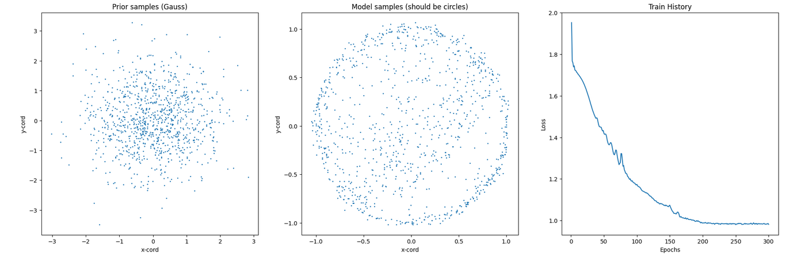
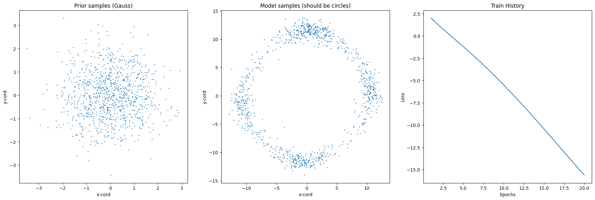
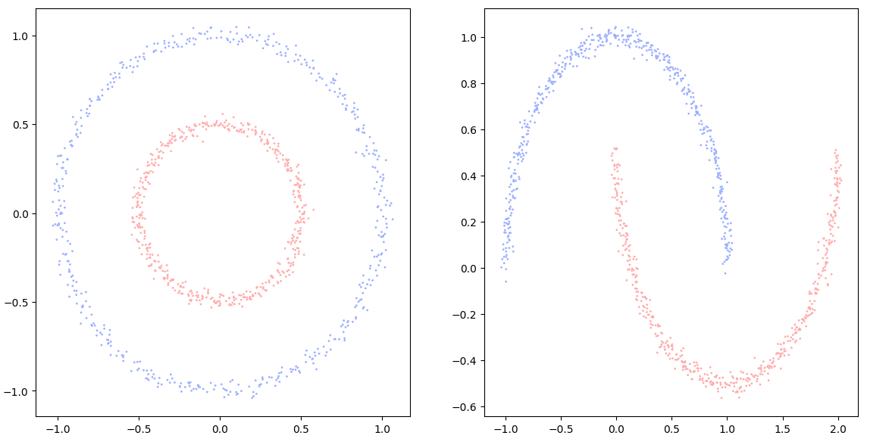
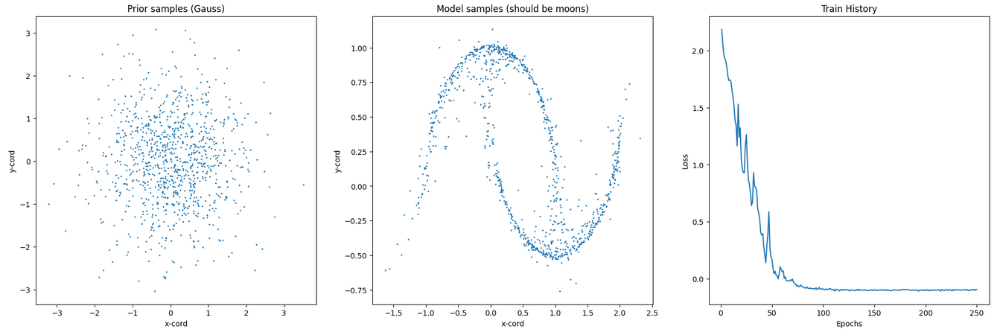
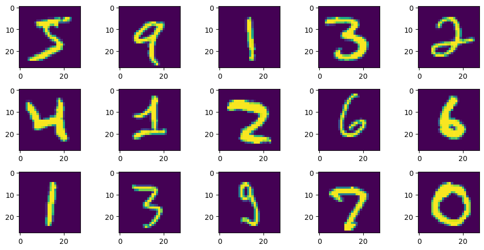
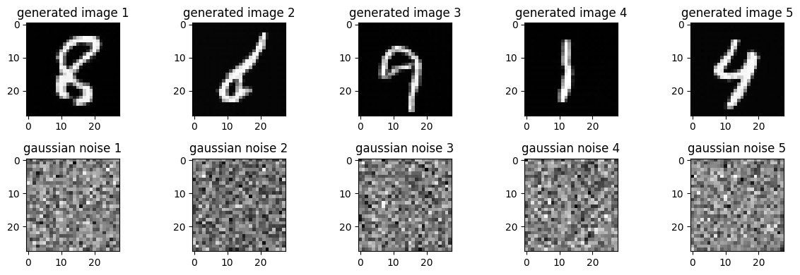
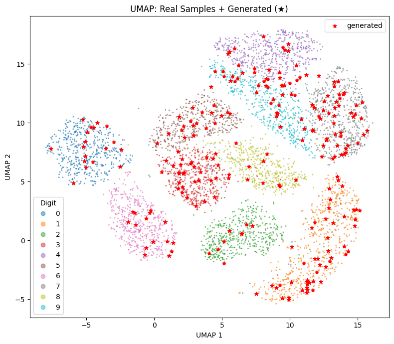

# 01 — Foundations: Neural ODEs from Scratch

Building intuition for continuous normalizing flows from first principles,
implemented entirely from scratch in PyTorch — no high-level ODE libraries,
no galaxy data yet.

This stage is split into three parts: first getting comfortable with PyTorch
itself, then using that foundation to implement Neural ODEs from scratch, and
finally scaling to CNF-based image generation on MNIST.

---

## Part A — Introduction to PyTorch

Before implementing ODE theory, I build familiarity with the tools used
throughout the entire project.

**Topics covered:**

- Tensors, autograd and the computational graph
- Writing custom Model class
- Training loops, optimizers and loss functions
- Dataset, DataLoader, split
- Evaluation
- Simple regression example

The goal here is not a general PyTorch tutorial — it is specifically to get
an understanding of PyTorch and then learn it while implementing the Neural ODE.

Notebook: [`pytorch_introduction.ipynb`](./pytorch_introduction.ipynb)

---

## Part B — Neural ODEs from Scratch

Starting from the core idea of the Neural ODE paper (Chen et al., 2019):
instead of stacking discrete layers, parameterize the *derivative* of the hidden
state with a neural network and integrate it forward in time.

**Topics implemented from scratch:**

- Euler solver, RK4 solver
- The adjoint sensitivity method for memory-efficient backpropagation through
  an ODE solver (the three coupled ODEs for state, adjoint, and ∂L/∂θ)
- An MLP vector field f(z, t, θ) as the continuous dynamics
- Training a CNF with self written methods to map a standard Gaussian to **circle** distribution
- Extending to a **spiral** distribution

Notebooks: [`circle-spiral-flow.ipynb`](./circle-spiral-flow.ipynb) (Flow Matching
version) and [`circle-spiral-flow-wrong-MLE.ipynb`](./circle-spiral-flow-wrong-MLE.ipynb)
(earlier MLE version, kept as a record of the incorrect MLE formulation described below).

---

## Part C — MNIST Digit Generation

Scaling the Neural ODE implementation to image data as a bridge toward the
galaxy pipeline.

**Topics covered:**

- Training a CNF on MNIST to generate handwritten digits in pixel space
- Visualize the trained distribution with UMAP and compare it with original MNIST data distribution.

Notebooks: [`neural-ode-mnist-gen.ipynb`](./neural-ode-mnist-gen.ipynb) (MLE) and
[`neural-ode-mnist-flowmatching.ipynb`](./neural-ode-mnist-flowmatching.ipynb) (Flow Matching).

---

## Status

**Done:** PyTorch introduction, ODE Solvers (RK4 and Euler), Adjoint Method, Model Class, Training loop, Evaluation, Hutchinson Trace Estimate, Regularization for Circle/Spiral, Circle experiment, Spiral experiment, ResNet-Block, FiLM injection of time t, UMAP of original MNIST data, FFJORD implementation, Regularization Techniques (Paper RNODE), Flow Matching, MNIST Generation, UMAP of original and generated MNIST data

---

## Known Issues & Findings

### Circle Distribution: Training Difficulty

The circle distribution proved challenging to learn due to a mismatch between the Gaussian prior and the target geometry. The prior concentrates most of its probability mass near the origin, whereas the target distribution places mass along a ring, precisely where the prior is sparsest. This forces the vector field to transport a large amount of probability mass over long distances, making training slow.

After a sufficient number of epochs the model produced output loosely resembling two arcs, at which point the experiment was stopped. A less concentrated prior (e.g. uniform) would be a better choice for ring-shaped targets in future runs.

*Circle experiment: after many epochs the model reaches the two-arc shape described above.*

### MNIST: Trace Cheating

The dominant failure mode in CNF training via MLE is trace cheating: the model exploits volume contraction to drive delta_log_p artificially negative, inflating the log-likelihood without learning a meaningful density.
Three structural root causes were identified:

1. FiLM scaling (γ): The learned scale parameter γ directly multiplies the Jacobian diagonal at every conditioned layer, giving the optimizer a direct handle on the trace.
2. Skip connections: In a UNet, skip connections add independent Jacobian contributions additively, while the main encoder–decoder path compounds γ-scaling multiplicatively through the chain rule, amplifying the effect across depth.
3. Hutchinson estimator variance: The stochastic trace estimate introduces noise the optimizer can exploit, biasing estimates further negative.

#### Interventions and outcomes:

A direct penalty on delta_log_p had limited effect. It is marginally helpful in the 2D setting, ineffective on MNIST. 
Switching to a simpler architecture closer to the original FFJORD paper (single CNF, no skip connections, time t concatenated as an input channel) delayed the onset but did not eliminate trace cheating beyond epoch 8. 
Adding RNODE regularization (Frobenius norm penalty on the Jacobian), dequantization, and a logit preprocessing step (mapping (0,1) → ℝ via logit, avoiding the singularities at 0 and 1 that arise when pixel values hit the boundary of the support) together resolved trace cheating: training showed bounded positive delta_log_p, stable NFE (~52–64), and declining loss. However, MLE training remained infeasible on a single GPU, slow odeint evaluations, high NFE, and the tendency of maximum likelihood to produce mode collapse in high dimensions make it impractical for MNIST-scale data without significant compute.

#### Conclusion:

MLE training of CNFs on high-dimensional image data is not tractable on a single GPU in reasonable time: trace cheating causes mode collapse, and the underlying incentive structure of maximum likelihood makes this a structural problem rather than a tuning problem. Flow Matching eliminates this failure mode by replacing likelihood with a direct MSE objective on the vector field, making it the natural next step.

### MNIST: Flow Matching

Flow Matching replaces the MLE objective with direct regression on the vector field. A straight-line path is defined between noise and data samples at training time, the network learns to predict the corresponding velocity. This removes the ODE solve from the training loop entirely — no adjoint, no trace estimation, no NFE pressure — which eliminates trace cheating structurally rather than by regularization.

Training on MNIST converged stably and generation quality improved substantially over the MLE runs. The RNODE architecture (SingleFlow CNN, time t as input channel) was reused almost without modification (added skip connections which made problems when using MLE), but mostly only the training objective changed. This confirms that the architecture itself was not the bottleneck in prior runs.

### Implementation findings

- **Incorrect MLE formulation**: early runs omitted the delta_log_p term in the change-of-variables formula, causing the model to receive no learning signal. Subsequently, a sign error in the vector field MLE caused the model to push probability mass outward rather than concentrating it.
- **Activation functions**: ReLU replaced with Tanh for better
  differentiability and Lipschitz continuity of the vector field
- **Double Tanh bug**: output layer had Tanh applied twice, artificially
  bounding the vector field to [-1.5, 1.5] and preventing the model from
  transporting mass far enough from the origin
- **First larger PyTorch project**: encountered typical beginner issues with
  batch dimensions propagating correctly through the augmented state vector
  [z, delta_log_p],  particularly when concatenating and slicing the state
  across the ODE solver, adjoint backward pass, and loss calculation

*An early bug in the adjoint-method implementation — the recovered gradients / dynamics were initially wrong.*

---

## Results & Visualizations

### 2D toy distributions

*The original 2D target distribution the CNF learns to map the Gaussian prior onto.*

*Second 2D experiment (file: `training_moon_distribution.png`).*

Notebooks:

- Flow Matching version: [`circle-spiral-flow.ipynb`](./circle-spiral-flow.ipynb)
- Earlier MLE version: [`circle-spiral-flow-wrong-MLE.ipynb`](./circle-spiral-flow-wrong-MLE.ipynb)

### MNIST

*Original MNIST digits.*

*Digits generated by the Flow-Matching CNF.*

*UMAP of the MNIST data manifold: original vs. generated samples.*

Notebooks:

- CNF with MLE: [`neural-ode-mnist-gen.ipynb`](./neural-ode-mnist-gen.ipynb)
- CNF with Flow Matching: [`neural-ode-mnist-flowmatching.ipynb`](./neural-ode-mnist-flowmatching.ipynb)

Stage 1 establishes the full CNF training pipeline — from adjoint-based MLE through FFJORD and RNODE regularization to Flow Matching — and identifies the structural limits of each approach on image data. The key result is not a generation quality score but a diagnostic: MLE-based CNF training is computationally intractable on a single GPU at MNIST scale, and Flow Matching resolves this by replacing the likelihood objective entirely. These findings directly inform the architecture choices in Stage 2.

## References

- Chen et al. (2019) — *Neural Ordinary Differential Equations*
  [`arXiv:1806.07366`](https://arxiv.org/abs/1806.07366)
- Grathwohl et al. (2018) — *FFJORD: Free-form Continuous Dynamics for Scalable Reversible Generative Models*
  [`arXiv:1810.01367`](https://arxiv.org/abs/1810.01367)
- Finlay et al. (2020) — *How to Train Your Neural ODE: the World of Jacobian and Kinetic Regularization*
  [`arXiv:2002.02798`](https://arxiv.org/abs/2002.02798)
- Lipman et al. (2023) — *Flow Matching for Generative Modeling*
  [`arXiv:2210.02747`](https://arxiv.org/abs/2210.02747)