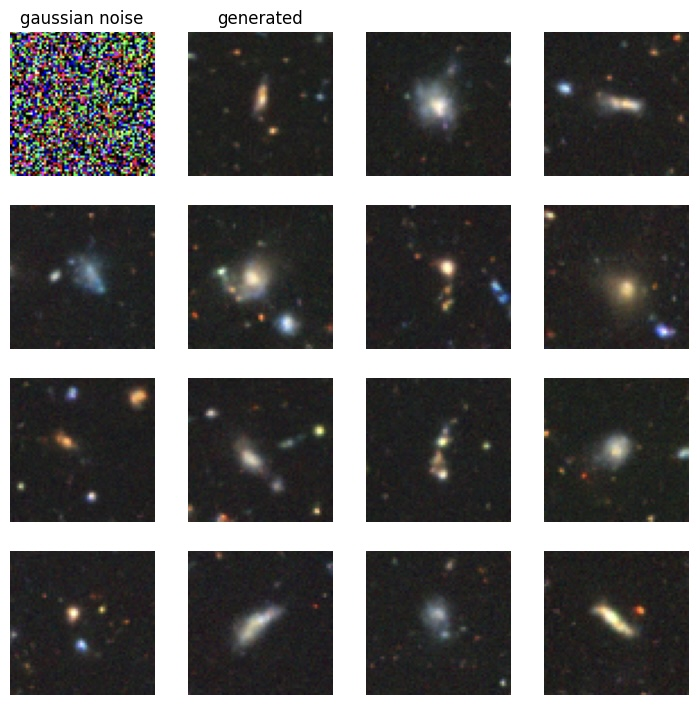
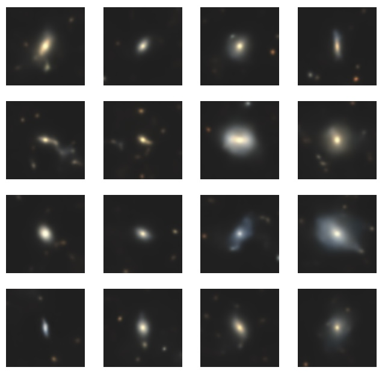
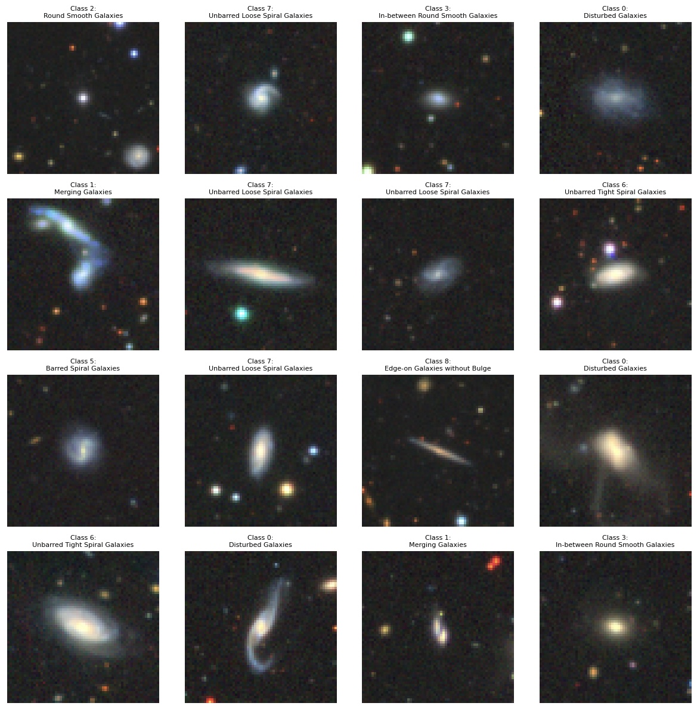
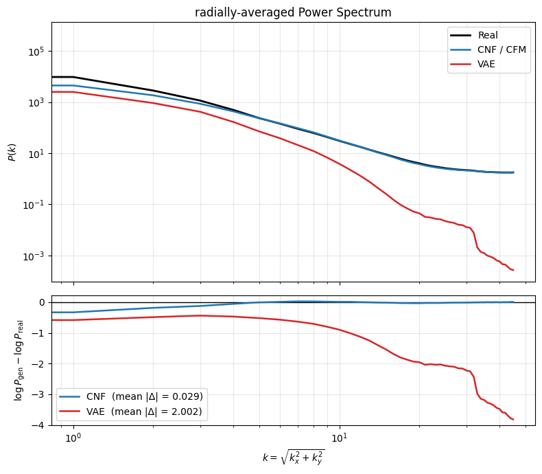
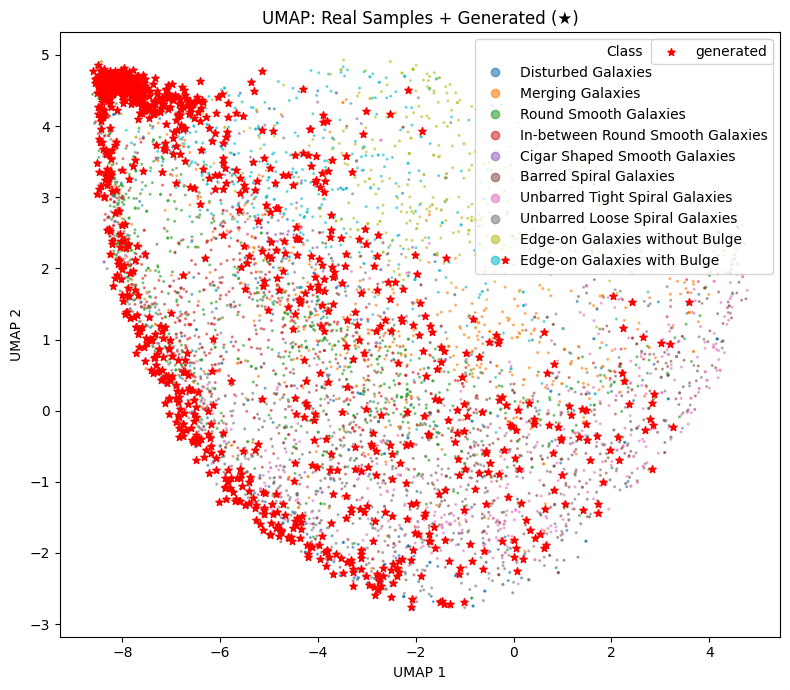

# 02 — Galaxy CNF: Scaling to Real Image Data

Scaling the continuous normalizing flow from toy 2D distributions to real 64×64 galaxy images from the Galaxy10 DECaLS dataset. The central question: can a CNF learn the complex, multimodal structure of galaxy morphology — and does it outperform the VAE baseline trained during the exam project?

The short answer is yes. Under Flow Matching the CNF produces sharp galaxies that reproduce the full DECaLS texture — spiral arms, edge-on disks, colour variation, and the noisy, star-speckled background of the real survey. The VAE baseline is a respectable comparison rather than a failure: it recovers recognizable morphology, but renders everything softer and on a cleaned-up background, losing the high-frequency detail the CNF keeps. The gap shows up cleanly in both FID (55.66 vs. 108.08) and the radial power spectrum. This stage documents the architectural and numerical decisions that made that possible, and the evaluation setup that makes the comparison quantitative rather than anecdotal.

---

## Goals

- Scale the Neural ODE / CNF architecture from Part 01 to high-dimensional,
  multimodal image data
- Systematically study the architectural and numerical tradeoffs that only
  appear at this scale (normalization, activation, skip connections, prior/data
  scale mismatch)
- Compare the CNF against the exam VAE baseline on the same dataset, both
  qualitatively and quantitatively

---

## Approach

The pipeline reuses the Flow Matching foundation from Stage 1 rather than returning to adjoint-based MLE. Stage 1 established that MLE-CNF training is intractable at image scale (trace cheating, high NFE, mode collapse); at 64×64×3 those problems only get worse, so MLE was never a candidate here.

**Pipeline:**

- **Data:** Galaxy10 DECaLS, 64×64 RGB, 10 morphology classes
- **Preprocessing:** simple `[-1, 1]` rescaling (no dequantization / logit step)
- **Model:** U-Net vector field `v(x, t)` regressed with the Conditional Flow
  Matching (CFM) objective along straight-line probability paths
- **Sampling:** integrate the learned velocity field from noise to data with
  `torchdiffeq` at inference time
- **Evaluation:** radially-averaged power spectrum, FID, and UMAP of the
  latent manifold
- **Compute:** Kaggle (free T4 GPU, ~30 hr/week)

---

## Status

**Done:** Galaxy10 data pipeline and `[-1, 1]` preprocessing, U-Net vector field (ResBlocks, GroupNorm, SiLU, skip connections), CFM training loop on Kaggle, sampling via `torchdiffeq`, radial power spectrum implementation, FID via `torchmetrics`, UMAP of real vs. generated samples, full CNF-vs-VAE comparison.

---

## Known Issues & Findings

### Architecture: from Stage-1 constraints to a proper U-Net

The most important structural change from Stage 1 is that **Flow Matching lifts the constraints that shaped the earlier architecture**. Under MLE the network sat inside the ODE solver and every design choice had to keep the Jacobian trace well-behaved. Under FM the network only regresses a velocity field — there is no trace estimation in the loop — so several choices that were previously off-limits become not just safe but preferable.

- **Skip connections are back.** In Stage 1 they were avoided because they add
  independent Jacobian contributions that inflate Hutchinson trace-estimator
  variance and feed trace cheating. Under FM there is no trace estimate to
  corrupt, so the U-Net skip connections can be used freely. They clearly helped,
  and the gain is attributable to the skips rather than to raw capacity: enlarging
  the network on its own did not improve generation significantly, whereas adding
  skips on top of the larger network did. The concrete role they play is carrying
  spatial detail across the encoder–decoder bottleneck that would otherwise be lost —
  which is what a full-resolution velocity field needs and where a VAE fails.
- **Normalization matters and GroupNorm over BatchNorm.** Without
  normalization the network still trained fine — same training behaviour — but
  the resulting model generated noticeably worse samples. So normalization is
  buying output quality, not training stability. The role is architectural: it
  helps the flow re-center its activations along the linear probability path,
  where the input mean and scale shift continuously with t. For the choice of
  normalizer: because that input scale varies systematically with t,
  BatchNorm would mix samples drawn at different t values into shared batch
  statistics and corrupt the normalization; GroupNorm normalizes per-sample and
  is invariant to that mixing.
- **SiLU over Softplus.** Softplus is strictly positive, so every unit contributes a
  same-signed positive offset that biases the features one way. SiLU can output negative
  values (bounded below), so positive and negative contributions can partly counteract
  instead of piling up in one direction. This gives the field more freedom to change
  sign across the domain, which is exactly what transporting mass in different directions
  requires.

### Preprocessing: canonical overshoot at generation time

Mapping an unbounded Gaussian prior to bounded pixel data through a
diffeomorphism structurally cannot keep samples inside `[0, 1]`; a small
overshoot past the boundary is guaranteed, not a bug. The correct fix is
`clamp(0, 1)` at **visualization time only** — the model is left untouched and
the density map stays a valid diffeomorphism.

### Training: the CFM loss floor is not a quality signal

The CFM objective has an irreducible floor set by the conditional variance of
the target velocity: even a perfect model cannot drive the MSE to zero, because
the regression target is stochastic. Consequently the raw loss value says
almost nothing about sample quality — two runs at very different loss can
generate comparably good (or bad) samples (The Bound changes depending on the
different Hyperparameters such as sigma_min, training step and others).
**Sample quality and UMAP coverage are the true arbiters**, and training was
judged on those rather than on the loss curve alone.

### Evaluation: choosing metrics that actually mean something for galaxies

- **Radial power spectrum (primary).** 2D FFT --> squared magnitude --> radial
  binning --> radial Power Spectrum. This is the domain-appropriate metric: it directly
  measures how well generated images reproduce structure across spatial frequencies,
  which is exactly what "sharp vs. blurry" means physically.
- **FID (secondary, relative only).** `torchmetrics` `FrechetInceptionDistance`
  with `feature=2048`, `normalize=True`. Inception is trained on natural
  images, not galaxies, so the absolute value is off-domain and should not be
  over-interpreted — but it remains valid as a **relative** CNF-vs-VAE
  comparison on the same feature space.
- **UMAP (qualitative).**  The reducer is fit on the real images, and the
generated samples are then projected into that fixed embedding with
`transform`. This keeps the real data as the reference frame — the manifold is
defined by real galaxies and the generated points are placed relative to it,
which is what makes "do generated samples land where the real ones are?" a
clean question. A subtle trap: the generated samples must be flattened with the
same tensor layout (CHW vs. HWC) as the real ones, or the transform receives
permuted features and every generated point collapses into a single artificial
cluster that looks like mode collapse but is purely a layout bug.

---

## Results & Visualizations

**Sample quality.** The CNF generates sharp galaxies that reproduce part of the
range of Galaxy10 morphology — spiral arms, edge-on disks, bars, mergers, colour
variation — together with the noisy, star-speckled background characteristic of
real DECaLS imagery. The VAE baseline is not a failure: it recovers recognizable
galaxy morphology (edge-on disks, bars, ellipticals, colour variation) and is
perfectly legible. Its limitation is high-frequency detail — it renders galaxies
softer and denoises the background to a clean dark field, dropping the fine
texture and foreground stars that the CNF preserves.

*CNF samples: sharp morphology (spiral arms, edge-on disks, bars) with the noisy, star-speckled DECaLS background.*

*VAE samples: recognizable morphology, but softer and on a denoised background.*

*Real Galaxy10 DECaLS images, for reference.*

**FID.** 55.66 (CNF) vs. 108.08 (VAE) — the CNF roughly halves the score. FID is
off-domain in absolute terms (Inception is trained on natural images, not
galaxies), but as a relative comparison on a shared feature space it agrees with
the power-spectrum and visual results.

**Power spectrum (the key quantitative result).** The CNF maintains a roughly
flat log-difference against real galaxies across spatial frequencies. The VAE
loses power at high frequencies — the frequency-domain signature of exactly the
softening and background-denoising visible in its samples. This quantifies the
qualitative difference instead of asserting it: the two models are close at low
frequencies (overall galaxy shape) and diverge at high frequencies (fine texture
and background noise).

*Radially-averaged power spectrum: the CNF tracks the real spectrum across
frequencies, while the VAE falls off at high frequency.*

**Latent manifold (UMAP).** With the real manifold as the fixed reference frame,
the generated samples spread out rather than collapsing to a point — there is no
wholesale mode collapse — but they do not cover the manifold uniformly. The
projected points concentrate into a few dense clusters, and checking which
Galaxy10 labels populate those clusters shows they are dominated by classes 2,
3, 7 and 9. The classes with finer morphological structure are generated far
less often, which is why coverage is incomplete: the limitation is one of
learnability — fine morphological detail is harder for the flow to reproduce —
rather than a failure of the flow to spread mass. This is the clearest signpost
for where a future version has room to improve.

*Real galaxies define the embedding; generated samples are projected in with
`transform`. Dense clusters are dominated by classes 2, 3, 7 and 9.*

Plots (generated galaxies, power spectrum, UMAP, CNF-vs-VAE panels) are in:

- CNF (Flow Matching): [`neural_ode_galaxy_gen.ipynb`](./neural_ode_galaxy_gen.ipynb)
- VAE baseline: [`vae_galaxy_gen.ipynb`](./vae_galaxy_gen.ipynb)
- Evaluation & comparison: [`CNF_vs_VAE_evaluation.ipynb`](./CNF_vs_VAE_evaluation.ipynb)

Result figures are in [`images/`](./images)

---

## Conclusion

Stage 2 answers the central question: a Flow-Matching CNF learns the multimodal
structure of galaxy morphology at 64×64 and clearly outperforms the VAE
baseline, with the advantage showing up not just visually but in the power
spectrum — the domain-appropriate metric. Just as importantly, the stage shows
that the Stage-1 architectural constraints were artifacts of the MLE objective:
once the trace estimator leaves the training loop, skip connections, proper
normalization and a real U-Net all become available, and the architecture that
failed under MLE succeeds under FM. The remaining density non-uniformity is a
finetuning problem not a modeling failure.

---

## References

- Chen et al. (2019) — *Neural Ordinary Differential Equations*
  [`arXiv:1806.07366`](https://arxiv.org/abs/1806.07366)
- Lipman et al. (2024) — *Flow Matching Guide and Code*
  [`arXiv:2412.06264`](https://arxiv.org/abs/2412.06264)
- Galaxy10 DECaLS — galaxy morphology dataset (part of the `astroNN` package, but scaled to 64x64 pixel images)